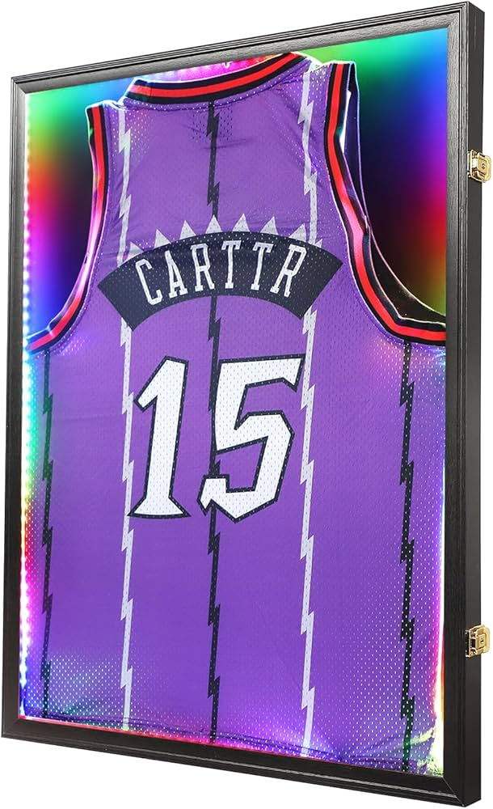

# Absolute Authentics - Premium Sports Memorabilia

A luxury e-commerce website for authenticated sports memorabilia featuring premium design, Firebase backend, and inquiry-based sales system.



## 🌟 Features

- **Premium Luxury Design** - Gold gradients, smooth animations, professional aesthetic
- **Product Catalog** - Filterable store with search, categories, and price ranges
- **Firebase Backend** - Scalable, real-time database for products and inquiries
- **Inquiry System** - Contact-based sales (no checkout required)
- **Newsletter VIP List** - Photo collage popup with subscriber management
- **Sell Now Page** - Form for customers wanting to sell memorabilia
- **Fully Responsive** - Optimized for mobile, tablet, and desktop
- **SEO Optimized** - Semantic HTML and meta tags

## 📁 Project Structure

```
absolute-authentics/
├── index.html              # Homepage
├── store.html              # Product catalog page
├── sell.html               # Sell inquiry page
├── css/
│   ├── style.css           # Main styles
│   ├── store.css           # Store page styles
│   ├── sell.css            # Sell page styles
│   ├── newsletter-popup.css
│   ├── premium-enhancements.css
│   ├── payment-plans.css
│   ├── who-we-are.css
│   ├── about-section.css
│   ├── contact-section.css
│   ├── store-highlight.css
│   ├── store-light-theme.css
│   └── theme-toggle.css
├── js/
│   ├── main.js             # Homepage functionality
│   ├── store.js            # Store page + Firebase integration
│   └── sell.js             # Sell page functionality
├── images/                 # Hero images and assets
└── firebase-config.js      # Firebase configuration (YOU NEED TO CREATE THIS)
```

## 🚀 Quick Start

### Prerequisites

- Web browser (Chrome, Firefox, Safari)
- Firebase account (free tier works great)
- Text editor (VS Code recommended)

### Setup Instructions

1. **Clone this repository**
   ```bash
   git clone https://github.com/YOUR_USERNAME/absolute-authentics.git
   cd absolute-authentics
   ```

2. **Set up Firebase** (see detailed instructions below)

3. **Configure Firebase credentials**
   - Create `firebase-config.js` in the root directory
   - Add your Firebase credentials (template provided below)

4. **Open in browser**
   ```bash
   # Option 1: Open directly
   open index.html
   
   # Option 2: Use local server (recommended)
   npx serve
   # or
   python3 -m http.server 8000
   ```

5. **Visit** `http://localhost:8000`

## 🔥 Firebase Setup (IMPORTANT!)

This website uses Firebase for:
- Product database
- Newsletter subscribers
- Customer inquiries
- Sell inquiries
- Image storage

### Step 1: Create Firebase Project

1. Go to [Firebase Console](https://console.firebase.google.com/)
2. Click "Create a project"
3. Name it: `absolute-authentics`
4. Disable Google Analytics (optional)
5. Click "Create project"

### Step 2: Enable Firestore Database

1. In Firebase Console → **Build** → **Firestore Database**
2. Click **"Create database"**
3. Choose **"Start in test mode"** (for now)
4. Select location closest to you
5. Click **"Enable"**

### Step 3: Create Collections

Create these 4 collections in Firestore:

**A) products**
- Fields: title, description, price, category, athlete, year, imageUrls, condition, authenticity, itemNumber, featured, available, views, tags, createdAt, updatedAt

**B) newsletter_subscribers**
- Fields: name, email, phone, interests, subscribedAt, source, active

**C) inquiries**
- Fields: name, email, phone, productId, productTitle, message, status, createdAt, source

**D) sell_inquiries**
- Fields: name, email, phone, itemType, athlete, authentication, description, estimatedValue, photoUrls, status, submittedAt

### Step 4: Enable Cloud Storage

1. In Firebase Console → **Build** → **Storage**
2. Click **"Get Started"**
3. Choose **"Start in test mode"**
4. Click **"Done"**

### Step 5: Get Firebase Credentials

1. Click **gear icon** (⚙️) → **Project settings**
2. Scroll to **"Your apps"** → Click **"</>"** (Web)
3. Register app: `absolute-authentics-web`
4. **COPY** the firebaseConfig object

### Step 6: Create firebase-config.js

Create a file called `firebase-config.js` in the root directory:

```javascript
// Firebase Configuration
import { initializeApp } from 'https://www.gstatic.com/firebasejs/10.7.1/firebase-app.js';
import { getFirestore, collection, getDocs, addDoc, doc, getDoc, query, where, orderBy, limit, updateDoc } from 'https://www.gstatic.com/firebasejs/10.7.1/firebase-firestore.js';
import { getStorage, ref, uploadBytes, getDownloadURL } from 'https://www.gstatic.com/firebasejs/10.7.1/firebase-storage.js';

// YOUR FIREBASE CONFIG (paste from Step 5)
const firebaseConfig = {
  apiKey: "YOUR_API_KEY_HERE",
  authDomain: "YOUR_PROJECT.firebaseapp.com",
  projectId: "YOUR_PROJECT_ID",
  storageBucket: "YOUR_PROJECT.appspot.com",
  messagingSenderId: "YOUR_SENDER_ID",
  appId: "YOUR_APP_ID"
};

// Initialize Firebase
const app = initializeApp(firebaseConfig);
const db = getFirestore(app);
const storage = getStorage(app);

// Export for use in other files
export { db, storage, collection, getDocs, addDoc, doc, getDoc, query, where, orderBy, limit, updateDoc, ref, uploadBytes, getDownloadURL };
```

**⚠️ IMPORTANT:** Replace `YOUR_*` placeholders with your actual Firebase credentials!

### Step 7: Update Security Rules

**Firestore Rules:**
```javascript
rules_version = '2';
service cloud.firestore {
  match /databases/{database}/documents {
    match /products/{productId} {
      allow read: if true;
      allow write: if false; // Only admin can write
    }
    match /newsletter_subscribers/{subscriberId} {
      allow create: if true;
      allow read, update, delete: if false;
    }
    match /inquiries/{inquiryId} {
      allow create: if true;
      allow read, update, delete: if false;
    }
    match /sell_inquiries/{inquiryId} {
      allow create: if true;
      allow read, update, delete: if false;
    }
  }
}
```

**Storage Rules:**
```javascript
rules_version = '2';
service firebase.storage {
  match /b/{bucket}/o {
    match /products/{allPaths=**} {
      allow read: if true;
      allow write: if false;
    }
  }
}
```

## 📝 How to Add Products

### Option 1: Firebase Console (Easiest)

1. Go to Firebase Console → Firestore Database
2. Click on `products` collection
3. Click "Add document"
4. Add fields manually

### Option 2: Programmatically (Recommended)

Use the Firebase Admin SDK or create a simple admin panel.

Example product structure:
```javascript
{
  title: "Chicago Bulls 6-Time NBA Champions Banner",
  description: "Authentic championship banner...",
  price: 1299.99,
  category: "Basketball",
  athlete: "Michael Jordan / Chicago Bulls",
  year: "1991-1998",
  imageUrls: ["https://...", "https://..."],
  condition: "Excellent",
  authenticity: "Serial Number: SH057399",
  itemNumber: "CHI-001",
  featured: true,
  available: true,
  views: 0,
  tags: ["Bulls", "Jordan", "Championship"],
  createdAt: serverTimestamp(),
  updatedAt: serverTimestamp()
}
```

## 🎨 Customization

### Update Contact Information

Edit these files:
- `js/main.js` → Line 7-14 (CONTACT_INFO object)
- `js/store.js` → Line 7-14 (CONTACT_INFO object)
- `js/sell.js` → Line 7-14 (CONTACT_INFO object)

### Change Colors

Main colors defined in CSS variables:
- Gold: `#FFD700`, `#B8860B`
- Cyan: `#00d4ff`, `#0099dd`
- Dark: `#0a0a0a`, `#1a1a1a`

### Update Images

Replace images in `/images/` folder:
- `hero-frame1.jpg` - Main hero image
- `hero-frame2.jpg` - Secondary hero image
- `hero-frame3.jpg` - Third hero image
- `brady-display.jpg` - Tom Brady section
- Other product/collection images

## 🔧 Tech Stack

- **Frontend:** HTML5, CSS3, Vanilla JavaScript
- **Backend:** Firebase (Firestore + Cloud Storage)
- **Fonts:** Inter (Google Fonts)
- **Icons:** Font Awesome 6.4.0
- **Hosting:** Can deploy to any static hosting (Netlify, Vercel, Firebase Hosting, GitHub Pages)

## 📱 Browser Support

- Chrome (latest)
- Firefox (latest)
- Safari (latest)
- Edge (latest)
- Mobile browsers (iOS Safari, Chrome Mobile)

## 🚀 Deployment Options

### Option 1: Firebase Hosting (Recommended)
```bash
npm install -g firebase-tools
firebase login
firebase init hosting
firebase deploy
```

### Option 2: Netlify
1. Connect GitHub repo
2. Deploy automatically on push

### Option 3: Vercel
1. Import GitHub repo
2. Deploy with zero config

### Option 4: GitHub Pages
1. Push to GitHub
2. Settings → Pages → Deploy from main branch

## 📞 Support & Contact

**Business Contact:**
- Name: Jonah Sakhai
- Phone: (310) 938-1236
- Email: Jonahsakhai@gmail.com
- Instagram: [@absoluteauthentics](https://instagram.com/absoluteauthentics)

## 📄 License

This is proprietary software for Absolute Authentics. All rights reserved.

## 🙏 Acknowledgments

Built with modern web technologies and Firebase for scalability and reliability.

---

**Need help?** Open an issue or contact the development team.
